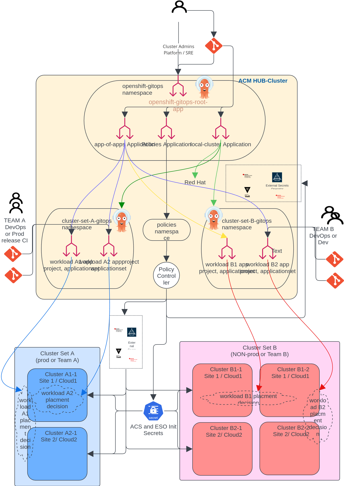

# argocd-rhacm
Use ArgoCD openshift-gitops to deploy and "gitops" RHACM manifests instea of the native ACM Application/Subscription.

It is focused on Azure Dev Ops or GitHub as a git repository and using ArgoCD as the only tool to deliver Applications.  That is, without any use of ACM Channels, Subscriptions or Applications.  Without use ACM Applications even in delivering ACM's own manfiests for operation.  It will use ArgoCD and Application Sets only for all Application instantiation as well.

This includes secrets handling with ESO see digram below for an example of how it used.

First find and replace my repo URL with yours.

``` bash
grep -r argocd-rhacm
gitops-root-applications/local-cluster-acm-policies.yaml:    repoURL: https://github.com/ngner/argocd-rhacm.git
gitops-root-applications/local-cluster-applications.yaml:    repoURL: https://github.com/ngner/argocd-rhacm.git
gitops-root-applications/local-cluster-configurations.yaml:    repoURL: https://github.com/ngner/argocd-rhacm.git
START-HERE/kustomization.yaml:  - url=https://github.com/ngner/argocd-rhacm.git
START-HERE/kustomization.yaml:  - username=argocd-rhacm
START-HERE/root-app/gitops-root-app.yaml:    repoURL: https://github.com/ngner/argocd-rhacm.git
START-HERE/root-app/openshift-gitops-instance.yaml:  url: https://github.com/ngner/argocd-rhacm.git

```

